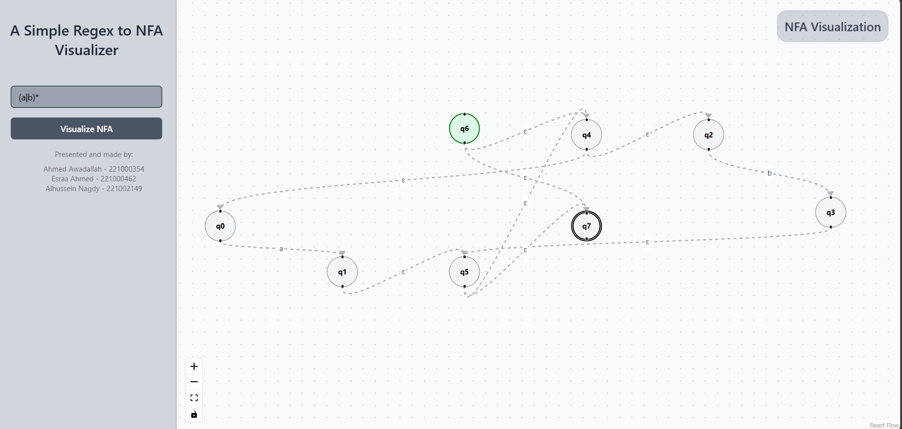
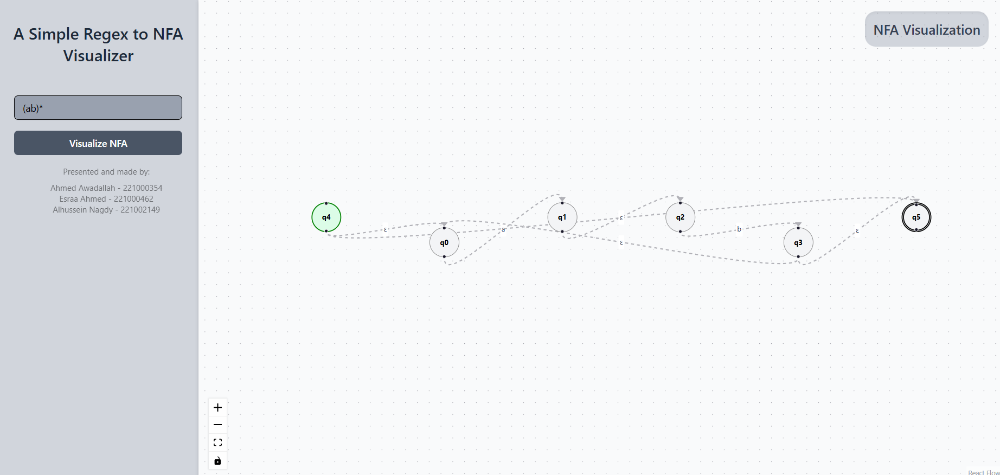

# A Simple Regex to NFA Converter + Visualizer

# Presented and made by:
Ahmed Awadallah - 221000354

Esraa Ahmed - 221000462

Alhussein Nagdy - 221002149


## Overview:

This is, as the title implies, a very simple Regular Expression String to Nondeterministic Finite Automaton Converter, with an element of visualization.

## Mechanisms:

### The first part is the Regex Parser:

This component prepares the regular expression before building the NFA.
It works in three main steps: 
1. Concatenation Insertion: Automatically inserts explicit concatenation operators (.) between characters that should be concatenated (for example, converting ab into a.b). 
2. Postfix Conversion: Converts the concatenated regular expression from infix to postfix form using the Shunting Yard Algorithm. 
3. Integration Step: Combines both steps into one function that first adds concatenation symbols, then converts the result to postfix, and finally sends it to the NFA builder for processing.

### The second part is the NFA Builder:

This part takes a postfix regular expression and builds its matching NFA using Thompson’s Algorithm.
It processes the expression symbol by symbol, creating and connecting small NFAs using ε-transitions for operations like union (|), concatenation (.), and repetition (\*).
Finally, it outputs all states, start and accept states, and transitions in a clear format so the visualization part can display the NFA easily.

### The third part is the Visualization & UI:

The frontend receives NFA data from the backend and visually represents it using ReactFlow. The process goes:
1. Parsing the JSON response taken from the NFA Builder.
2. Constructing the graph using ReactFlow.
3. Generating a layout to avoid intersections between States and Transitions.
 
 Alongside some Styling and Interactability provided by ReactFlow. 

## Input format:

Regular expression string (e.g. a|b)

## Output format:

NFA data structure as JSON & NFA Visualization

e.g.:

```
{
  "states": ["q0", "q1", "q2", "q3", "q4", "q5"],
  "start": "q0",
  "accept": "q5",
  "transitions": [
    {"from": "q0", "to": "q1", "symbol": "a"},
    {"from": "q1", "to": "q2", "symbol": "ε"},
    {"from": "q2", "to": "q3", "symbol": "b"},
    {"from": "q2", "to": "q4", "symbol": "c"},
    {"from": "q3", "to": "q2", "symbol": "ε"},
    {"from": "q4", "to": "q2", "symbol": "ε"},
    {"from": "q2", "to": "q5", "symbol": "d"}
  ]
}
```

## Programming Language, Tools & Libraries:
### Backend & API: Python
Using FastAPI, Pydantic, Uvicorne

### Frontend & Visualization: Javascript
Using React.ts, ReactFlow, ShadCN, and Tailwind for CSS

## Screenshots & Samples:




